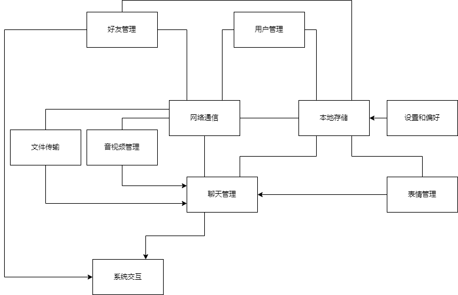

<h1 align="center">QQ</h1>
<p align="center">
  
  
  
</p>

> 这是一个基于Qt（支持Qt版本5.15.2至6.6.2）+CMake+VSCode的类似QQ的实时通信和社交软件（客户端），开发用于支持Windows、Linux和macOS。该软件包括三个模块：登录、桌面和后台。其功能包括好友管理、聊天管理、文件管理、表情符号管理（支持Unicode-encoded表情符号库）和语音识别（需要外部FFMPEG支持），并保留用于服务器端集成的接口。

# 目录

[TOC]

# 项目依赖

为了构建和运行本项目，您需要安装以下依赖：

- **Qt**: 版本>= 5.15.2 [Qt 官网](https://www.qt.io/download)
- **CMake**:版本>=3.10 [CMake 官网](https://cmake.org/download/)
- **ElaWidgetTools**:版本>=1.0 [官方仓库](https://github.com/Liniyous/ElaWidgetTools)
- **qt-material-widgets**:版本无要求[官方仓库](https://github.com/laserpants/qt-material-widgets)

# 下载与安装

```sh
git clone https://github.com/somethinggo/QQ.git
cd QQ
mkdir build #这一步可以省略(构建还是会在bin目录中)
cd build
cmake ..
cmake -DCMAKE_BUILD_TYPE=Release .. #指定编译选项
make #生成的文件在bin目录中
```

# 模块划分



## 公共模块

### **模块职责**

公共模块的主要职责是提供整个系统所需的通用资源和基础支持，包括：

- **公共宏**：定义全局使用的宏，用于简化代码书写，增强可读性，或实现一些常用的编译时功能。
- **公共枚举**：用于定义一组相关的常量值，这些值可以用来表示状态、选项、类型或其他分类信息。
- **公共函数**：封装常用的功能性代码，这些函数可以被系统中的其他模块直接调用，避免重复实现，提高代码复用性。
- **公共组件**：提供一些跨模块使用的UI组件或逻辑组件，例如通用的按钮、对话框、输入框等，使得界面风格和功能体验在各个模块之间保持一致。
- **基础配置**：包含系统的基本配置选项，例如文件路径、网络配置、调试模式开关等，确保系统在不同环境下能够灵活适配。
- **全局样式设定**：定义应用程序的全局样式，如主题、字体、颜色方案等，确保整个系统的界面风格统一、视觉效果一致。

### **具体设定**

**公共宏**

<table>
    <thead>
        <tr>
            <th>宏名称</th>
            <th>用途描述</th>
            <th>示例代码</th>
        </tr>
    </thead>
    <tbody>
        <tr>
            <td><code>Q_MSINGLETON_CREATE(Class)</code></td>
            <td>实现类的单例模式，确保程序中只有一个该类的实例。</td>
            <td><pre><code>class MyClass {<br>public:<br>    static MyClass& instance() {<br>        static MyClass instance;<br>        return instance;<br>    }<br>private:<br>    MyClass() {} // Constructor is private<br>    Q_MSINGLETON_CREATE(MyClass)<br>};</code></pre></td>
        </tr>
        <tr>
            <td><code>Q_MDECLARE_FLAGS(Class, Enum, Base, Config)</code></td>
            <td>在类中声明可组合的枚举标志，允许枚举值组合使用。</td>
            <td><pre><code>class MyClass {<br>    Q_MDECLARE_FLAGS(MyClass, MyEnum, int, MyConfig)<br>};</code></pre></td>
        </tr>
        <tr>
            <td><code>Q_MDECLARE_OPERATORS_FOR_FLAGS(Flags)</code></td>
            <td>为强类型枚举定义位操作符，如取反、与、或、异或等。</td>
            <td><pre><code>enum class MyFlags : int {<br>    Flag1 = 1 << 0,<br>    Flag2 = 1 << 1<br>};<br>Q_MDECLARE_OPERATORS_FOR_FLAGS(MyFlags)</code></pre></td>
        </tr>
        <tr>
            <td><code>Q_MPROPERTY_CREATE(Type, FunctionName, Name)</code></td>
            <td>快速创建类的属性，包括 getter 和 setter 函数，以及 `Q_PROPERTY` 声明。</td>
            <td><pre><code>class MyClass {<br>    Q_MPROPERTY_CREATE(int, getValue, value)<br>private:<br>    int value;<br>};</code></pre></td>
        </tr>
        <tr>
            <td><code>Q_MREGISTER_EVENT(EventName, Number)</code></td>
            <td>注册自定义事件，定义事件类型和数据结构。</td>
            <td><pre><code>Q_MREGISTER_EVENT(MyEvent, 1234)</code></pre></td>
        </tr>
        <tr>
            <td><code>Q_MSEND_EVENT(EventName, Data)</code></td>
            <td>将事件异步发送到主线程的事件循环中。</td>
            <td><pre><code>Q_MSEND_EVENT(MyEvent, myData)</code></pre></td>
        </tr>
        <tr>
            <td><code>Q_MHANDLE_EVENT(EventName, Receiver, Handler)</code></td>
            <td>在事件处理函数中快速匹配并处理指定事件类型。</td>
            <td><pre><code>Q_MHANDLE_EVENT(MyEvent, myReceiver, myHandler)</code></pre></td>
        </tr>
    </tbody>
</table>


**公共枚举**:对应namespace(QQEnums)

<table>
    <thead>
        <tr>
            <th>枚举名称</th>
            <th>用途描述</th>
        </tr>
    </thead>
    <tbody>
        <tr>
            <td><code>EventType</code></td>
            <td>定义系统中使用的事件类型，例如登录、注册、发送消息等。</td>
        </tr>
        <tr>
            <td><code>DirectionType</code></td>
            <td>定义方向类型，例如从左到右、从右到左。</td>
        </tr>
        <tr>
            <td><code>RoundPostionType</code></td>
            <td>定义蒙版的圆角位置类型，例如左上角、右下角等。</td>
        </tr>
        <tr>
            <td><code>FileSizeType</code></td>
            <td>定义文件大小的单位，例如字节、千字节、兆字节等。</td>
        </tr>
        <tr>
            <td><code>InformationPostionType</code></td>
            <td>定义信息的位置，例如左侧、底部。</td>
        </tr>
        <tr>
            <td><code>InformationWidgetType</code></td>
            <td>定义信息展示的控件类型，例如图标、标签、控件等。</td>
        </tr>
        <tr>
            <td><code>AppBarHintType</code></td>
            <td>定义标题栏的提示类型，例如最小化按钮、最大化按钮等。</td>
        </tr>
        <tr>
            <td><code>EmojiType</code></td>
            <td>定义表情的类型，例如 Unicode 表情、图片表情、GIF 表情。</td>
        </tr>
        <tr>
            <td><code>PeopleWidgetType</code></td>
            <td>定义人员展示的类型，例如好友聊天、群组聊天、好友列表等。</td>
        </tr>
    </tbody>
</table>


**公共函数**:对应namespace(QQFunctions)

<table>
    <thead>
        <tr>
            <th>API 名称</th>
            <th>用途描述</th>
            <th>示例代码</th>
        </tr>
    </thead>
    <tbody>
        <tr>
            <td><code>initSystem()</code></td>
            <td>初始化系统资源或配置。</td>
            <td><pre><code>QQFunctions::initSystem();</code></pre></td>
        </tr>
        <tr>
            <td><code>exitSystem()</code></td>
            <td>释放系统资源或执行清理操作。</td>
            <td><pre><code>QQFunctions::exitSystem();</code></pre></td>
        </tr>
        <tr>
            <td><code>getUserInfo(const QString &ID)</code></td>
            <td>获取用户信息。<br><strong>参数</strong>：用户 ID。<br><strong>返回值</strong>：用户信息对象。</td>
            <td><pre><code>auto userInfo = QQFunctions::getUserInfo("user123");</code></pre></td>
        </tr>
        <tr>
            <td><code>getGroupInfo(const QString &ID)</code></td>
            <td>获取群组信息。<br><strong>参数</strong>：群组 ID。<br><strong>返回值</strong>：群组信息对象。</td>
            <td><pre><code>auto groupInfo = QQFunctions::getGroupInfo("group123");</code></pre></td>
        </tr>
        <tr>
            <td><code>getRounedPixmap(const QPixmap &src, int radius)</code></td>
            <td>获取圆角图片。<br><strong>参数</strong>：源图片、圆角半径。<br><strong>返回值</strong>：圆角图片。</td>
            <td><pre><code>QPixmap roundedPixmap = QQFunctions::getRounedPixmap(srcPixmap, 10);</code></pre></td>
        </tr>
        <tr>
            <td><code>getCalculateTextRects(const QString &text, const QFont &font, quint64 MAXW, bool elided)</code></td>
            <td>获取文本绘制区域和适应区域的文本。<br><strong>参数</strong>：文本、字体、最大宽度、是否省略。<br><strong>返回值</strong>：绘制区域和文本。</td>
            <td><pre><code>auto [rect, adjustedText] = QQFunctions::getCalculateTextRects("Sample text", font, 200);</code></pre></td>
        </tr>
        <tr>
            <td><code>getRoundedMask(const QSize &size, qreal radius, ClientEnums::RoundPostionTypes types)</code></td>
            <td>获取圆角蒙版。<br><strong>参数</strong>：尺寸、圆角半径、圆角位置类型。<br><strong>返回值</strong>：圆角蒙版。</td>
            <td><pre><code>QBitmap mask = QQFunctions::getRoundedMask(QSize(100, 100), 10, ClientEnums::RoundPostionType::topLeft);</code></pre></td>
        </tr>
        <tr>
            <td><code>getRotatePixmap(const QPixmap &src, qreal angle)</code></td>
            <td>获取旋转图片。<br><strong>参数</strong>：源图片、旋转角度。<br><strong>返回值</strong>：旋转后的图片。</td>
            <td><pre><code>QPixmap rotatedPixmap = QQFunctions::getRotatePixmap(srcPixmap, 45);</code></pre></td>
        </tr>
        <tr>
            <td><code>getFileFormatSize(qint64 bytes)</code></td>
            <td>获取文件格式大小和单位。<br><strong>参数</strong>：字节数。<br><strong>返回值</strong>：大小和单位。</td>
            <td><pre><code>auto [size, unit] = QQFunctions::getFileFormatSize(1024000);</code></pre></td>
        </tr>
        <tr>
            <td><code>getImageToBase64(const QImage &image)</code></td>
            <td>获取图片的 Base64 编码。<br><strong>参数</strong>：图片。<br><strong>返回值</strong>：编码和图片类型。</td>
            <td><pre><code>auto [base64, imageType] = QQFunctions::getImageToBase64(image);</code></pre></td>
        </tr>
        <tr>
            <td><code>getImageToBase64(const QString &fileName)</code></td>
            <td>获取文件的 Base64 编码。<br><strong>参数</strong>：文件名。<br><strong>返回值</strong>：编码和图片类型。</td>
            <td><pre><code>auto [base64, imageType] = QQFunctions::getImageToBase64("image.png");</code></pre></td>
        </tr>
        <tr>
            <td><code>getBase64ToImage(const QString &base64)</code></td>
            <td>将 Base64 编码转为图片。<br><strong>参数</strong>：Base64 编码。<br><strong>返回值</strong>：图片。</td>
            <td><pre><code>QImage image = QQFunctions::getBase64ToImage(base64);</code></pre></td>
        </tr>
        <tr>
            <td><code>getGenerateRandomText(int min, int max)</code></td>
            <td>生成一段随机文本。<br><strong>参数</strong>：最小长度、最大长度。<br><strong>返回值</strong>：随机文本。</td>
            <td><pre><code>QString randomText = QQFunctions::getGenerateRandomText(5, 10);</code></pre></td>
        </tr>
        <tr>
            <td><code>getMouseIsInWidget(QWidget *widget)</code></td>
            <td>检查鼠标是否在指定控件内。<br><strong>参数</strong>：控件。<br><strong>返回值</strong>：是否在控件内。</td>
            <td><pre><code>bool isInside = QQFunctions::getMouseIsInWidget(myWidget);</code></pre></td>
        </tr>
    </tbody>
</table>


**公共组件**:对应namespace(QQWidgets)

<table>
    <thead>
        <tr>
            <th>组件名称</th>
            <th>用途描述</th>
            <th>API 名称</th>
            <th>API 作用</th>
            <th>API 示例代码</th>
        </tr>
    </thead>
    <tbody>
        <tr>
            <td rowspan="5"><code>AppBar</code></td>
            <td rowspan="5">自定义的应用程序标题栏，支持窗口标志设置、标题、图标以及拖动和调整大小功能。</td>
            <td><code>setWindowsFlag</code></td>
            <td>设置窗口标志。</td>
            <td><code>appBar.setWindowsFlag(Qt::FramelessWindowHint);</code></td>
        </tr>
        <tr>
            <td><code>setWindowsFlags</code></td>
            <td>设置多个窗口标志，覆盖之前的标志。</td>
            <td><code>appBar.setWindowsFlags(Qt::FramelessWindowHint | Qt::WindowStaysOnTopHint);</code></td>
        </tr>
        <tr>
            <td><code>getWindowsFlags</code></td>
            <td>获取当前窗口标志。</td>
            <td><code>Qt::WindowFlags flags = appBar.getWindowsFlags();</code></td>
        </tr>
        <tr>
            <td><code>setWindowsTitle</code></td>
            <td>设置窗口标题和对齐方式。</td>
            <td><code>appBar.setWindowsTitle("My App", Qt::AlignCenter);</code></td>
        </tr>
        <tr>
            <td><code>setWindowsIcon</code></td>
            <td>设置窗口图标。</td>
            <td><code>appBar.setWindowsIcon(QIcon(":/icons/app_icon.png"));</code></td>
        </tr>
        <tr>
            <td rowspan="3"><code>AnimationTabBar</code></td>
            <td rowspan="3">自定义的选项卡控件，支持动画效果和样式定制。</td>
            <td><code>setMargin</code></td>
            <td>设置选项卡的外边距。</td>
            <td><code>tabBar.setMargin(10);</code></td>
        </tr>
        <tr>
            <td><code>setContentsMargins</code></td>
            <td>设置选项卡的外边距，支持单独设置每个边距。</td>
            <td><code>tabBar.setContentsMargins(5, 10, 5, 10);</code></td>
        </tr>
        <tr>
            <td><code>getContentsMargins</code></td>
            <td>获取选项卡的外边距。</td>
            <td><code>QMargins margins = tabBar.getContentsMargins();</code></td>
        </tr>
        <tr>
            <td rowspan="7"><code>MessageDialog</code></td>
            <td rowspan="7">自定义的消息对话框，支持设置标题、按钮和警告信息。</td>
            <td><code>setShadowParent</code></td>
            <td>设置对话框的阴影窗口。</td>
            <td><code>dialog.setShadowParent(this);</code></td>
        </tr>
        <tr>
            <td><code>setTittle</code></td>
            <td>设置对话框标题。</td>
            <td><code>dialog.setTittle("Warning");</code></td>
        </tr>
        <tr>
            <td><code>setOkButtonEnable</code></td>
            <td>设置确定按钮是否可用。</td>
            <td><code>dialog.setOkButtonEnable(true);</code></td>
        </tr>
        <tr>
            <td><code>addWidget</code></td>
            <td>添加控件到对话框中。</td>
            <td><code>dialog.addWidget(new QLabel("Message")); </code></td>
        </tr>
        <tr>
            <td><code>removeAllWidget</code></td>
            <td>移除对话框中的所有控件。</td>
            <td><code>dialog.removeAllWidget();</code></td>
        </tr>
        <tr>
            <td><code>setAlertInformation</code></td>
            <td>设置警告信息文本。</td>
            <td><code>dialog.setAlertInformation("Are you sure?");</code></td>
        </tr>
        <tr>
            <td><code>setFunction</code></td>
            <td>设置确定按钮的执行函数。</td>
            <td><code>dialog.setFunction([this]() { this->accept(); });</code></td>
        </tr>
        <tr>
            <td><code>StackWidget</code></td>
            <td>自定义的堆叠控件，支持动画效果的页面切换。</td>
            <td><code>setAnimationCurrentIndex</code></td>
            <td>设置当前页面并应用动画效果切换到指定索引的页面。</td>
            <td><code>stackWidget.setAnimationCurrentIndex(2);</code></td>
        </tr>
    </tbody>
</table>


**基础配置**::对应namespace(QQConfigs)

<table>
    <thead>
        <tr>
            <th>配置名称</th>
            <th>作用描述</th>
            <th>属性名称</th>
            <th>属性类型</th>
            <th>属性作用</th>
        </tr>
    </thead>
    <tbody>
        <tr>
            <td rowspan="10"><code>UserBaseConfig</code></td>
            <td rowspan="10">基础用户配置</td>
            <td><code>m_state</code></td>
            <td><code>UserStateType</code></td>
            <td>用户的当前状态，如在线、离线、忙碌等。</td>
        </tr>
        <tr>
            <td><code>m_ID</code></td>
            <td><code>std::string</code></td>
            <td>用户的唯一标识符。</td>
        </tr>
        <tr>
            <td><code>m_account</code></td>
            <td><code>std::string</code></td>
            <td>用户的账号。</td>
        </tr>
        <tr>
            <td><code>m_name</code></td>
            <td><code>std::string</code></td>
            <td>用户的名称。</td>
        </tr>
        <tr>
            <td><code>m_icon</code></td>
            <td><code>std::string</code></td>
            <td>用户的头像路径。</td>
        </tr>
        <tr>
            <td><code>m_sign</code></td>
            <td><code>std::string</code></td>
            <td>用户的个性签名。</td>
        </tr>
        <tr>
            <td><code>m_dynamicList</code></td>
            <td><code>std::vector<std::string></code></td>
            <td>用户的动态列表，包含动态表中的记录。</td>
        </tr>
        <tr>
            <td><code>m_password</code></td>
            <td><code>std::string</code></td>
            <td>用户的密码，仅在私有成员中存储。</td>
        </tr>
        <tr>
            <td><code>m_friendList</code></td>
            <td><code>std::vector<std::string></code></td>
            <td>用户的好友列表，来源于用户表。</td>
        </tr>
        <tr>
            <td><code>m_groupList</code></td>
            <td><code>std::vector<std::string></code></td>
            <td>用户的群聊列表，来源于群聊表。</td>
        </tr>
        <tr>
            <td rowspan="8"><code>GroupBaseConfig</code></td>
            <td rowspan="8">基础群聊配置</td>
            <td><code>m_state</code></td>
            <td><code>GroupStateType</code></td>
            <td>群聊当前的状态，如正常、禁止通知等。</td>
        </tr>
        <tr>
            <td><code>m_ID</code></td>
            <td><code>std::string</code></td>
            <td>群聊的唯一标识符。</td>
        </tr>
        <tr>
            <td><code>m_account</code></td>
            <td><code>std::string</code></td>
            <td>群聊的账号标识。</td>
        </tr>
        <tr>
            <td><code>m_name</code></td>
            <td><code>std::string</code></td>
            <td>群聊的名称。</td>
        </tr>
        <tr>
            <td><code>m_icon</code></td>
            <td><code>std::string</code></td>
            <td>群聊的图标路径。</td>
        </tr>
        <tr>
            <td><code>m_describe</code></td>
            <td><code>std::string</code></td>
            <td>群聊的描述信息。</td>
        </tr>
        <tr>
            <td><code>m_memberCount</code></td>
            <td><code>uint64_t</code></td>
            <td>群聊的成员数量。</td>
        </tr>
        <tr>
            <td><code>m_memberList</code></td>
            <td><code>std::vector<std::string></code></td>
            <td>群聊成员列表，来源于用户表。</td>
        </tr>
        <tr>
            <td rowspan="9"><code>MessageBaseConfig</code></td>
            <td rowspan="9">基础消息配置</td>
            <td><code>m_messageType</code></td>
            <td><code>MessageType</code></td>
            <td>消息的类型，如文本、图片、文件等。</td>
        </tr>
        <tr>
            <td><code>m_senderType</code></td>
            <td><code>SenderType</code></td>
            <td>发送者类型，如系统、时间、自己、他人等。</td>
        </tr>
        <tr>
            <td><code>m_ID</code></td>
            <td><code>std::string</code></td>
            <td>消息的唯一标识符（正在考虑去除）。</td>
        </tr>
        <tr>
            <td><code>m_senderID</code></td>
            <td><code>std::string</code></td>
            <td>发送者的唯一标识符。</td>
        </tr>
        <tr>
            <td><code>m_receiverID</code></td>
            <td><code>std::string</code></td>
            <td>接收者的唯一标识符。</td>
        </tr>
        <tr>
            <td><code>m_content</code></td>
            <td><code>std::string</code></td>
            <td>消息的具体内容。</td>
        </tr>
        <tr>
            <td><code>m_time</code></td>
            <td><code>std::time_t</code></td>
            <td>消息的发送时间。</td>
        </tr>
        <tr>
            <td><code>m_isSended</code></td>
            <td><code>bool</code></td>
            <td>消息是否已发送。</td>
        </tr>
        <tr>
            <td><code>m_isDownLoaded</code></td>
            <td><code>std::optional<bool></code></td>
            <td>当消息类型为文件时，属性有效，指示是否已下载。</td>
        </tr>
    </tbody>
</table>


**全局样式设定**::对应namespace(QQThemes)

| 属性名称                    |   类型   | 用途描述                                                |
| :-------------------------- | :------: | ------------------------------------------------------- |
| `g_font`                    | `QFont`  | 应用程序全局使用的默认字体。                            |
| `g_icon`                    | `QIcon`  | 应用程序全局使用的默认图标。                            |
| `g_line_color`              | `QColor` | 应用程序中使用的默认线条颜色。                          |
| `g_hover_opacity`           | `qreal`  | 控件悬停时的透明度设置。                                |
| `g_pressed_opacity`         | `qreal`  | 控件被按下时的透明度设置。                              |
| `m_emoji_tabbar_emoji_icon` | `QIcon`  | 表情选项卡中使用的表情图标，具有按下与未按下两种状态。  |
| `m_emoji_tabbar_like_icon`  | `QIcon`  | 表情选项卡中使用的点赞图标，具有按下与未按下两种状态。  |
| `m_emoji_tabbar_pressed`    | `QColor` | 表情选项卡按下时的背景颜色。                            |
| `m_emoji_tabbar_hovered`    | `QColor` | 表情选项卡悬停时的背景颜色。                            |
| `m_emojiLab_unicode_font`   | `QFont`  | 表情标签中使用的 Unicode 字体，适用于显示标准表情符号。 |
| `m_emojiLab_pressed`        | `QColor` | 表情标签按下时的背景颜色。                              |
| `m_emojiLab_hovered`        | `QColor` | 表情标签悬停时的背景颜色。                              |
| `m_emojiLab_append_icon`    | `QIcon`  | 表情标签中使用的附加图标。                              |

------

## 外部模块

### **模块职责**

外部模块的主要职责是提供整个系统所需的外部依赖

### **依赖配置**

- 包管理器(如vcpkg)：请遵循包管理器CMake配置要求，修改对应的CMakeLists.txt

- 没有包管理器，请遵循以下规则：

  向three/config.json中写入包对应的配置

  > 注意：默认您已经配置好了该依赖的所用外部依赖（即默认该依赖可以在您的设备上正常运行）
  >
  > 且该应用默认使用C++17（建议您的依赖均支持C++17即以上的版本）

  ```json
  {
      "packageName": "package",
      "version": "1.0.0",
      "libraryPath": "/path/to/library",
      "includePath": "/path/to/include",
      "binaryPath": "/path/to/binary",
      "resourcePath":"path/to/qrc",
      "debugExtension": "d"
  }
  ```

  

### 用户管理

- 提供用户登录，注册与忘记密码，同时附带对应的UI
- 维护用户的登录数据信息
- 与网络通信模块关联，向服务器发送请求，同时关联本地存储模块，记录登录信息

### 好友管理

- 维护好友与群组的数据信息（本身值提供增删查改的功能，并不存储信息），同时附带对应的UI
- 与网络通信模块关联，向服务器发送请求，同时关联本地存储模块，记录数据信息

### 聊天管理

- 维护聊天数据信息（本身值提供增删查改的功能，并不存储信息），同时附带对应的UI
- 与网络通信模块关联，向服务器发送请求，同时关联本地存储模块，记录数据信息

### 表情管理

- 维护表情数据信息（本身值提供增删查改的功能，并不存储信息），同时附带对应的UI
- 关联本地存储模块，记录数据信息

### 设置与偏好

- 维护用户本地设置信息（本身提供修改功能，并不存储信息），同时附带对应的UI
- 关联本地存储模块，记录数据信息

### 文件传输

- 提供文件上传服务器的接口
- 与网络通信模块关联，向服务器发送请求，与聊天管理关联，用于及时更新界面

### 音视频管理

- 提供音视频上传服务器的接口与实时音视频交流的接口，同时附带对应的UI
- 与网络通信模块关联，向服务器发送请求，与聊天管理关联，用于及时更新界面

### 本地存储

- 记录本地的数据信息
- 与网络通信模块，用户管理，聊天管理，表情管理，设置与偏好关联，同步信息

### 网络通信

- 提供与服务器交互的接口
- 与本地存储，用户管理，聊天管理，文件传输，音视频管理关联，同步信息

### 系统交互

- 提供与程序之外的操作系统交互的接口
- 与聊天管理，好友管理关联，用于通知信息
