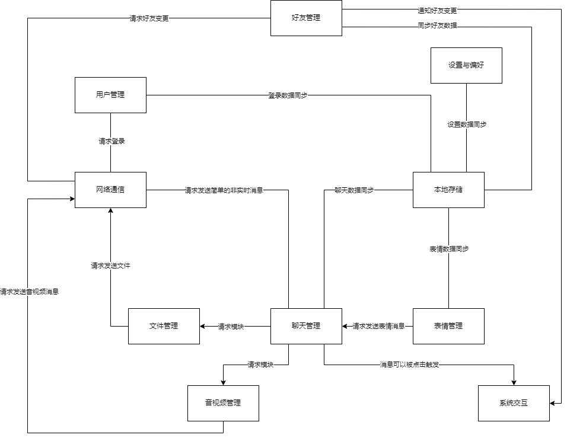
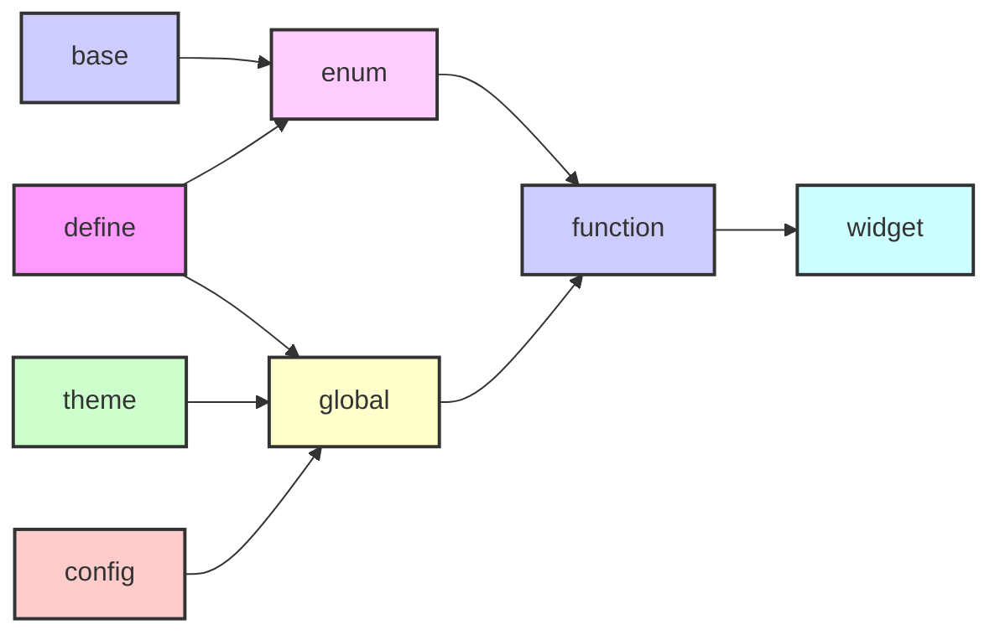
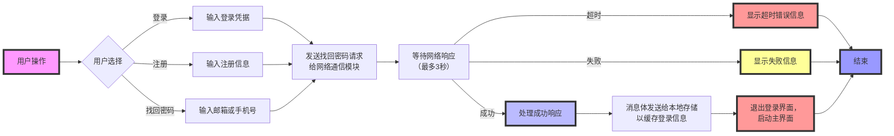
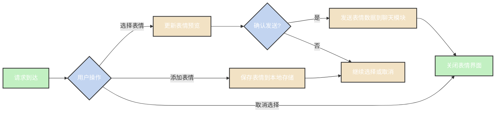
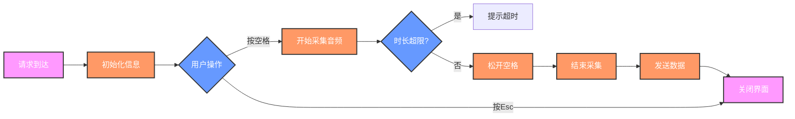

<h1 align="center">QQ</h1>
<p align="center">
  
  
  
</p>

> 这是一个基于Qt（支持Qt版本5.15.2至6.6.2）+CMake+VSCode的类似QQ的实时通信和社交软件（客户端），开发用于支持Windows、Linux和macOS。该软件包括三个模块：登录、桌面和后台。其功能包括好友管理、聊天管理、文件管理、表情符号管理（支持Unicode-encoded表情符号库）和语音识别（需要外部FFMPEG支持），并保留用于服务器端集成的接口。

# 目录

[TOC]

# 项目依赖

为了构建和运行本项目，您需要安装以下依赖：

- **Qt**: 版本>= 5.15.2 [Qt 官网](https://www.qt.io/download)
- **CMake**:版本>=3.10 [CMake 官网](https://cmake.org/download/)
- **ElaWidgetTools**:版本>=1.0 [官方仓库](https://github.com/Liniyous/ElaWidgetTools)
- **qt-material-widgets**:版本无要求[官方仓库](https://github.com/laserpants/qt-material-widgets)
- **ffmepg**:请使用二进制文件,版本保持最新[下载官网](https://www.gyan.dev/ffmpeg/builds/)
- **vcpkg**:版本保持最新[官方仓库](https://github.com/microsoft/vcpkg)
  - **FFTW3**:版本保持最新，通过vcpkg进行管理

# 下载与安装

```sh
git clone https://github.com/somethinggo/QQ.git
cd QQ
mkdir build #这一步可以省略(构建还是会在bin目录中)
cd build
cmake ..
cmake -DCMAKE_BUILD_TYPE=Release .. #指定编译选项
make #生成的文件在bin目录中
```

# 设计准则

- 模块之间使用消息总线通信
- 模块内部使用信号槽连接
- 模块的ui之间使用api调用

# 模块划分



## **公共模块**

### 模块职责

公共模块的主要职责是提供整个系统所需的通用资源和基础支持，包括：

- **公共宏**：定义全局使用的宏，用于简化代码书写，增强可读性，或实现一些常用的编译时功能。
- **公共枚举**：用于定义一组相关的常量值，这些值可以用来表示状态、选项、类型或其他分类信息。
- **公共函数**：封装常用的功能性代码，这些函数可以被系统中的其他模块直接调用，避免重复实现，提高代码复用性。
- **公共组件**：提供一些跨模块使用的UI组件或逻辑组件，使得界面风格和功能体验在各个模块之间保持一致。
- **基础配置**：包含系统的基本信息结构体配置。
- **全局变量**：存储全局的运行时信息（其实也会存储一些基础的常量设定）
- **全局样式**：定义应用程序的全局样式，如主题、字体、颜色方案等，确保整个系统的界面风格统一、视觉效果一致。


### 文件结构



### 具体设定

> 请参考文档[公共模块](./common/README.md)


## **外部模块**

### 模块职责

外部模块的主要职责是管理与配置整个系统所需的外部依赖

### 依赖配置

- 包管理器(如vcpkg)：请遵循包管理器CMake配置要求，修改对应的CMakeLists.txt

- 没有包管理器，请遵循以下规则：

  向three/config.json中写入包对应的配置

  ```json
  {
      "packageName": "package",
      "version": "1.0.0",
      "libraryPath": "/path/to/library",
      "includePath": "/path/to/include",
      "binaryPath": "/path/to/binary",
      "resourcePath":"path/to/qrc",
      "debugExtension": "d"
  }
  ```
  
  > 注意：默认您已经配置好了该依赖的所用外部依赖（即默认该依赖可以在您的设备上正常运行）
  >
  > 且该应用默认使用C++17（建议您的依赖均支持C++17即以上的版本）

## **用户管理**

### 模块职责

用户模块主要是负责用户的登录，注册与密码找回，与网络通信模块交互，并发送对应的消息体，同时响应其返回的消息体，同时更新全局用户变量。

> 具体消息请参考[模块通信消息表](#模块通信消息参考)

> 条件限制请参考[模块数据限制表](#模块数据限制参考)

> 样式设计请参考[全局样式设定](./common/README.md)

### 处理流程



## **聊天管理**

### 模块职责

管理用户的聊天索引，显示消息列表，提供简单的非实时的消息的输入与发送，同时作为其他发送信息的模块的直接调用者。

> 具体消息请参考[模块通信消息表](#模块通信消息参考)

> 条件限制请参考[模块数据限制表](#模块数据限制参考)

> 样式设计请参考[全局样式设定](./common/README.md)

### 视图设置

> 该模块基于Qt本身的MVD模式进行聊天索引的设置与消息列表的显示。

> 数据起始点均位于模型中的User枚举

- 聊天索引模型内部数据划分

<table>
    <thead>
        <tr>
            <th>编号</th>
            <th>类型</th>
            <th>用途</th>
            <th>备注</th>
        </tr>
    </thead>
    <tbody>
        <tr>
            <td>0</td>
            <td>QString</td>
            <td>好友(群组)ID</td>
            <td>唯一标识符号</td>
        </tr>
        <tr>
            <td>1</td>
            <td>QIcon</td>
            <td>好友(或群组)头像</td>
            <td>计算圆角</td>
        </tr>
        <tr>
            <td>2</td>
            <td>QString</td>
            <td>好友(或群组)名字</td>
            <td>适应屏幕,省略显示,优先显示昵称</td>
        </tr>
        <tr>
            <td>3</td>
            <td>QString</td>
            <td>好友(或群组)最后一条消息</td>
            <td>适应屏幕,省略显示</td>
        </tr>
        <tr>
            <td>4</td>
            <td>QString</td>
            <td>好友(或群组)最后一条消息的发送时间</td>
            <td>本质上是由std::time_t存储,在本地计算出对应的QString,计算规制为:若相差不到一天,显示时分秒,若相差不到两天,显示昨天,若相差不到一周,显示星期,否则显示年月日</td>
        </tr>
        <tr>
            <td>5</td>
            <td>uint64_t</td>
            <td>好友(或群组)未读消息数量</td>
            <td>上限显示未99+,如果好友(或群组)设置为免打扰,显示颜色为灰色,否则为红色</td>
        </tr>
        <tr>
            <td>6</td>
            <td>int(enum)</td>
            <td>好友(或群组)状态</td>
            <td>标识用户的状态设置</td>
        </tr>
    </tbody>
</table>

- 消息模型内部数据划分

<table>
    <thead>
        <tr>
            <th>编号</th>
            <th>类型</th>
            <th>用途</th>
            <th>备注</th>
        </tr>
    </thead>
    <tbody>
        <tr>
            <td>0</td>
            <td>QString</td>
            <td>消息唯一标识符</td>
            <td>使用发送者ID，接受者ID与发送时间唯一生成</td>
        </tr>
        <tr>
            <td>1</td>
            <td>int(enum)</td>
            <td>消息发送者类型</td>
            <td>适应屏幕</td>
        </tr>
        <tr>
            <td>2</td>
            <td>int(enum)</td>
            <td>消息类型</td>
            <td>适应屏幕</td>
        </tr>
        <tr>
            <td>3</td>
            <td>QIcon</td>
            <td>消息发送者头像</td>
            <td>计算圆角</td>
        </tr>
        <tr>
            <td>4</td>
            <td>QString</td>
            <td>消息发送者名称</td>
            <td>适应屏幕,省略显示,优先显示昵称</td>
        </tr>
        <tr>
            <td>5</td>
            <td>QString</td>
            <td>文本类型消息</td>
            <td>适应屏幕,包含文本,链接,文件名</td>
        </tr>
        <tr>
            <td>6</td>
            <td>QIcon</td>
            <td>图片类型消息</td>
            <td>适应屏幕,包含图片,文件图标</td>
        </tr>
        <tr>
            <td>7</td>
            <td>bool</td>
            <td>是否在发送中</td>
            <td>本地用户发送的消息默认发送中,系统消息与时间消息只有发送成功状态(不会向后台发送消息,存储在本地)</td>
        </tr>
        <tr>
            <td>8</td>
            <td>bool</td>
            <td>是否已经发送</td>
            <td>与是否在发送中配合使用</td>
        </tr>
        <tr>
            <td>9</td>
            <td>int</td>
            <td>文件下载进度,文件发送进度</td>
            <td>由于消息的唯一性,两者互不干扰</td>
        </tr>
        <tr>
            <td>10</td>
            <td>自定义</td>
            <td>额外信息</td>
            <td></td>
        </tr>
    </tbody>
</table>

## **好友管理**

### 模块职责

该模块主要是管理好友(群组)索引显示与详细信息显示，同时附带好友变更通知与添加好友界面

> 具体消息请参考[模块通信消息表](#模块通信消息参考)

> 条件限制请参考[模块数据限制表](#模块数据限制参考)

> 样式设计请参考[全局样式设定](./common/README.md)

### 视图设置

> 该模块基于Qt本身的MVD模式进行好友(群组)索引的设置。

> 数据起始点均位于模型中的User枚举

- 好友(群组)索引模型内部数据划分

<table>
    <thead>
        <tr>
            <th>编号</th>
            <th>类型</th>
            <th>用途</th>
            <th>备注</th>
        </tr>
    </thead>
    <tbody>
        <tr>
            <td>0</td>
            <td>好友(群组)指针</td>
            <td></td>
            <td>为后续的设计准备,或者是特殊的绘制</td>
        </tr>
        <tr>
            <td>1</td>
            <td>QIcon</td>
            <td>好友(群组)头像</td>
            <td>计算圆角</td>
        </tr>
        <tr>
            <td>2</td>
            <td>QString</td>
            <td>好友(群组)名称</td>
            <td>适应屏幕,显示为好友(群组)名称+"("+好友(群组)昵称+")"</td>
        </tr>
        <tr>
            <td>3</td>
            <td>QString</td>
            <td>好友签名,群组ID</td>
            <td>适应屏幕,省略显示</td>
        </tr>
    </tbody>
</table>


## **表情管理**

### 模块职责

该模块负责表情系统的显示与用户交互，维护表情数据。

> 具体消息请参考[模块通信消息表](#模块通信消息参考)

> 条件限制请参考[模块数据限制表](#模块数据限制参考)

> 样式设计请参考[全局样式设定](./common/README.md)

### 处理流程




## **音视频管理**

### 模块职责

该模块提供非实时音频的采集与发送请求，同时附带UI显示界面，显示通过FFTW3库分析出的频域分析数据

> 具体消息请参考[模块通信消息表](#模块通信消息参考)

> 条件限制请参考[模块数据限制表](#模块数据限制参考)

> 样式设计请参考[全局样式设定](./common/README.md)

### 处理流程



## **设置与偏好**


## **文件传输**


## **本地存储**


## 网络通信


## 系统交互


## 模块通信消息参考

  消息体基本结构

```json
{
    "version":"版本号",
    "sender":"发送者",
    "receiver":"接受者",
    "action":"行为",
    "data":
    {
        "key":"value"
    },
    "extend":"扩展"
}
```

> 注意：消息体默认使用json传输，异步发送，其中数据段可以使用多个键值对，扩展段是消息体的扩展，可以不使用（程序本身也不会解析）

消息通信表格

###  **1.0**

| 发送者  | 行为           | 数据                               |
| ------- | -------------- | ---------------------------------- |
| `login` | `login`        | account<br />password              |
| `login` | `logout`       |                                    |
| `login` | `registered`   | nickname<br />password<br />number |
| `login` | `findpassword` | number                             |
| `emoji` | `loademoji`    |                                    |
| `emoji` | `sendemoji`    | type<br />content                  |
| `emoji` | `addemoji`     | type<br />content                  |
| `audio` | `sendaudio`    | type<br />content                  |
|         |                |                                    |
|         |                |                                    |

## 模块数据限制参考


