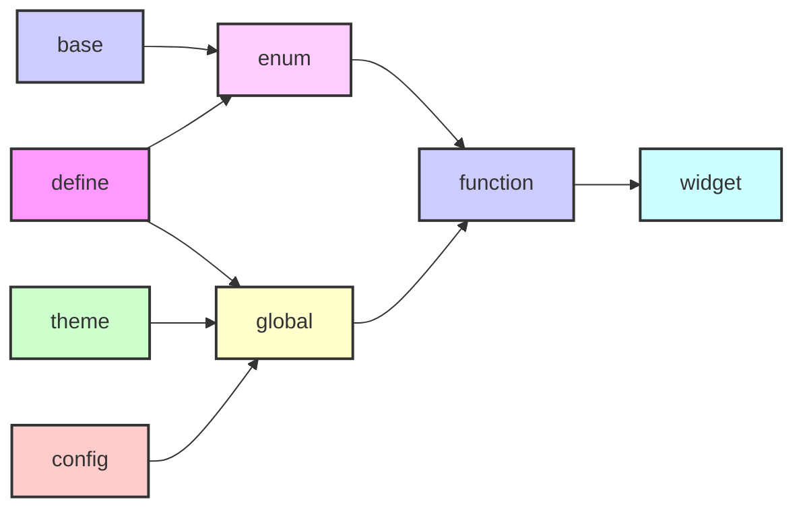
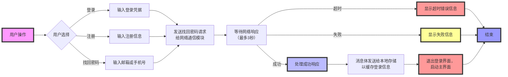

<h1 align="center">QQ</h1>
<p align="center">
  
  
  
</p>

> 这是一个基于Qt（支持Qt版本5.15.2至6.6.2）+CMake+VSCode的类似QQ的实时通信和社交软件（客户端），开发用于支持Windows、Linux和macOS。该软件包括三个模块：登录、桌面和后台。其功能包括好友管理、聊天管理、文件管理、表情符号管理（支持Unicode-encoded表情符号库）和语音识别（需要外部FFMPEG支持），并保留用于服务器端集成的接口。

# 目录

[TOC]

# 项目依赖

为了构建和运行本项目，您需要安装以下依赖：

- **Qt**: 版本>= 5.15.2 [Qt 官网](https://www.qt.io/download)
- **CMake**:版本>=3.10 [CMake 官网](https://cmake.org/download/)
- **ElaWidgetTools**:版本>=1.0 [官方仓库](https://github.com/Liniyous/ElaWidgetTools)
- **qt-material-widgets**:版本无要求[官方仓库](https://github.com/laserpants/qt-material-widgets)

# 下载与安装

```sh
git clone https://github.com/somethinggo/QQ.git
cd QQ
mkdir build #这一步可以省略(构建还是会在bin目录中)
cd build
cmake ..
cmake -DCMAKE_BUILD_TYPE=Release .. #指定编译选项
make #生成的文件在bin目录中
```

# 设计准则

- 模块之间使用消息总线通信
- 模块内部使用信号槽连接
- 模块的ui之间使用api调用

# 模块划分


## **公共模块**

### 模块职责

公共模块的主要职责是提供整个系统所需的通用资源和基础支持，包括：

- **公共宏**：定义全局使用的宏，用于简化代码书写，增强可读性，或实现一些常用的编译时功能。
- **公共枚举**：用于定义一组相关的常量值，这些值可以用来表示状态、选项、类型或其他分类信息。
- **公共函数**：封装常用的功能性代码，这些函数可以被系统中的其他模块直接调用，避免重复实现，提高代码复用性。
- **公共组件**：提供一些跨模块使用的UI组件或逻辑组件，例如通用的按钮、对话框、输入框等，使得界面风格和功能体验在各个模块之间保持一致。
- **基础配置**：包含系统的基本配置选项，例如文件路径、网络配置、调试模式开关等，确保系统在不同环境下能够灵活适配。
- **全局变量**：存储全局的运行时信息（其实也会存储一些基础的常量设定）
- **全局样式设定**：定义应用程序的全局样式，如主题、字体、颜色方案等，确保整个系统的界面风格统一、视觉效果一致。


### 文件结构



### 具体设定

> 请参考文档[公共模块](./common/README.md)


## **外部模块**

### 模块职责

外部模块的主要职责是管理与配置整个系统所需的外部依赖

### 依赖配置

- 包管理器(如vcpkg)：请遵循包管理器CMake配置要求，修改对应的CMakeLists.txt

- 没有包管理器，请遵循以下规则：

  向three/config.json中写入包对应的配置

  ```json
  {
      "packageName": "package",
      "version": "1.0.0",
      "libraryPath": "/path/to/library",
      "includePath": "/path/to/include",
      "binaryPath": "/path/to/binary",
      "resourcePath":"path/to/qrc",
      "debugExtension": "d"
  }
  ```
  
  > 注意：默认您已经配置好了该依赖的所用外部依赖（即默认该依赖可以在您的设备上正常运行）
  >
  > 且该应用默认使用C++17（建议您的依赖均支持C++17即以上的版本）

## **用户管理**

### 模块职责

用户模块主要是负责用户的登录，注册与密码找回，与网络通信模块交互，并发送对应的消息体，同时响应其返回的消息体，同时更新全局用户变量

> 具体消息请参考[模块通信消息表](#模块通信消息参考)

> 条件限制请参考[模块数据限制表](#模块数据限制参考)

### 处理流程



## **聊天管理**

- 维护聊天数据信息（本身值提供增删查改的功能，并不存储信息），同时附带对应的UI
- 与网络通信模块关联，向服务器发送请求，同时关联本地存储模块，记录数据信息

## **表情管理**

- 维护表情数据信息（本身值提供增删查改的功能，并不存储信息），同时附带对应的UI
- 关联本地存储模块，记录数据信息

## **设置与偏好**

- 维护用户本地设置信息（本身提供修改功能，并不存储信息），同时附带对应的UI
- 关联本地存储模块，记录数据信息

## **文件传输**

- 提供文件上传服务器的接口
- 与网络通信模块关联，向服务器发送请求，与聊天管理关联，用于及时更新界面

## **音视频管理**

- 提供音视频上传服务器的接口与实时音视频交流的接口，同时附带对应的UI
- 与网络通信模块关联，向服务器发送请求，与聊天管理关联，用于及时更新界面

## **本地存储**

- 记录本地的数据信息
- 与网络通信模块，用户管理，聊天管理，表情管理，设置与偏好关联，同步信息

## 网络通信

- 提供与服务器交互的接口
- 与本地存储，用户管理，聊天管理，文件传输，音视频管理关联，同步信息

## 系统交互

- 提供与程序之外的操作系统交互的接口

- 与聊天管理，好友管理关联，用于通知信息
- 
## 模块通信消息参考

  消息体基本结构

```json
{
    "version":"版本号",
    "sender":"发送者",
    "action":"行为",
    "data":
    {
        "key":"value"
    },
    "extend":"扩展"
}
```

> 注意：消息体默认使用json传输，异步发送，其中数据段可以使用多个键值对，扩展段是消息体的扩展，可以不使用（程序本身也不会解析）

消息通信表格

###  **1.0**

| 发送者  | 行为           | 数据                               |
| ------- | -------------- | ---------------------------------- |
| `login` | `login`        | account<br />password              |
| `login` | `logout`       |                                    |
| `login` | `registered`   | nickname<br />password<br />number |
| `login` | `findpassword` | number                             |
| `emoji` | `loademoji`    |                                    |
| `emoji` | `sendemoji`    | type<br />content                  |
| `emoji` | `addemoji`     | type<br />content                  |
| `audio` | `sendaudio`    | type<br />content                  |
|         |                |                                    |
|         |                |                                    |

## 模块数据限制参考


